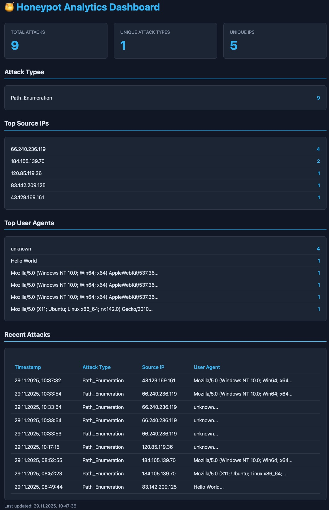

# Honeypot Lab Project

Complete honeypot system with attack detection, database, and analytics dashboard.

## Services

### Honeypot (Port 8080)
- Detects: SQL Injection, XSS, Path Traversal
- Logs to: file + database
- Rate limited: 60 req/min per IP

### Database (Port 5432)
- PostgreSQL 16
- Parameterized queries
- Limited user permissions

### Analytics (Port 5000)
- Real-time statistics
- Top IPs, user agents
- Recent attacks table

## Testing

**SQL Injection**
1. UNION SELECT → regex[0]: (union\s+(all\s+)?select)

curl -s "http://35.159.122.103/?id=1'+UNION+SELECT+1\,2\,3--" 

2. OR 1=1 → regex[1]: (or|and)\s+['\"]?1['\"]?\s*=\s*['\"]?1['\"]?

curl -s "http://35.159.122.103/?login=admin' OR '1'='1'"

# 3. SLEEP() → regex[7]: (sleep\s*\()

curl -s "http://35.159.122.103/?id=1; SLEEP\(5\)--"

**XSS**
1. onerror=alert (regex[1]) - < > jako %3C%3E

curl -s "http://35.159.122.103/?name=%3Cimg%20src=x%20onerror=alert(1)%3E"

2. SVG onload (regex[9]) - < > jako %3C%3E

curl -s "http://35.159.122.103/?input=%3Csvg%20onload=alert(1)%3E"

3. %3Cscript (regex[4]) - już zakodowany

curl -s "http://35.159.122.103/?data=%3Cscript%3Ealert(1)%3C/script%3E"

**Path Traversal**
1. c:/windows...

curl -s "http://35.159.122.103/?file=c:/windows/system32"

2. ../ → regex[0]: \.\.[/\\]
curl -s "http://35.159.122.103/?file=../../../etc/passwd"

3. %2e%2e/ → regex[1]: %2e%2e[/\\%2f%5c]
curl -s "http://35.159.122.103/?path=%2e%2e%2f%2e%2e%2fetc%2fpasswd"  

**Admin Access**

1. curl http://localhost:8080/admin

**API Enumeration**

1. scurl http://localhost:8080/api/users

## View Attacks

**Connect to database**

- docker exec -it honeypot_db psql -U honeypot_user -d honeypot_db

**Query**

- SELECT * FROM attacks ORDER BY timestamp DESC LIMIT 10;
- SELECT attack_name, COUNT() FROM attacks GROUP BY attack_name;
- SELECT source_ip, COUNT() FROM attacks GROUP BY source_ip ORDER BY 2 DESC;

## Security

- Parameterized queries prevent SQL injection
- Input sanitization
- Non-root execution
- Network isolation
- OWASP compliant

## Troubleshooting

**Check logs**

- docker-compose logs -f

**Restart**

- docker-compose restart

**Reset**

- docker-compose down -v
- docker-compose up -d
